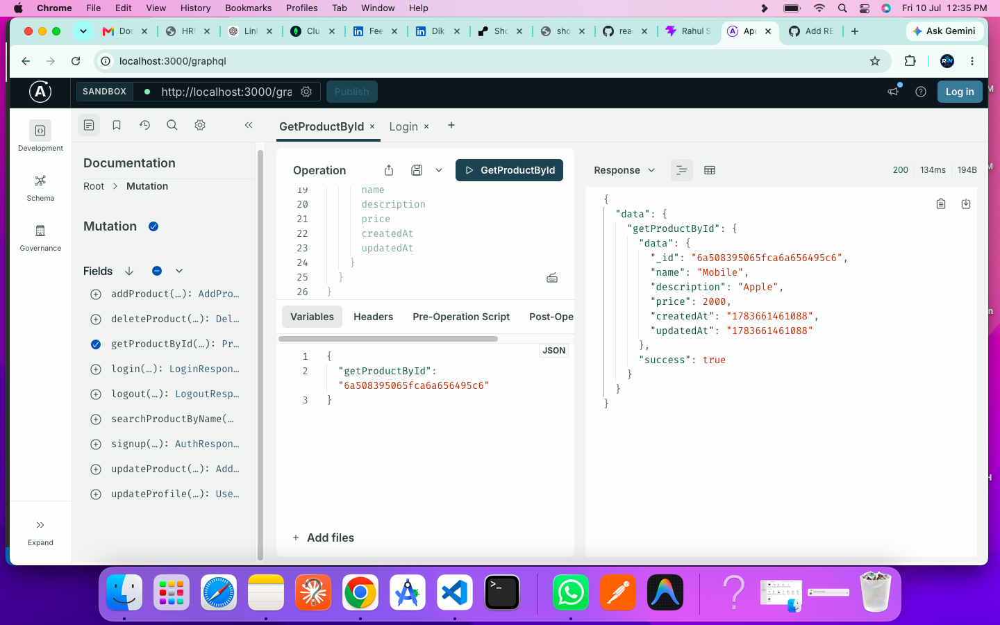
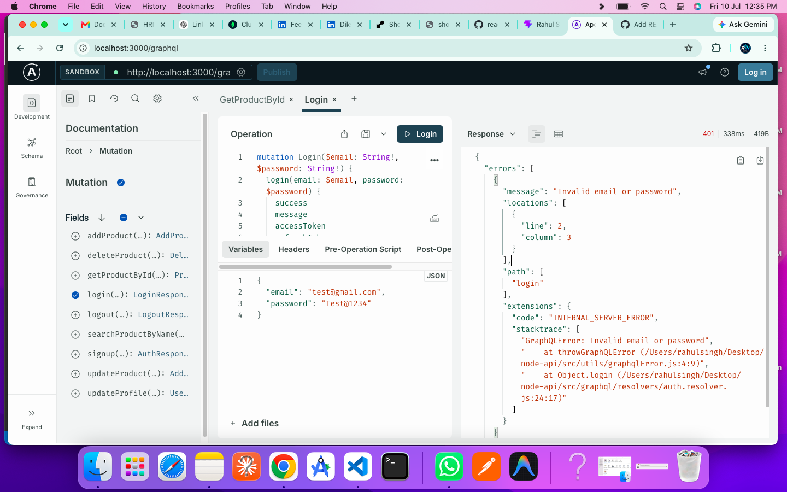
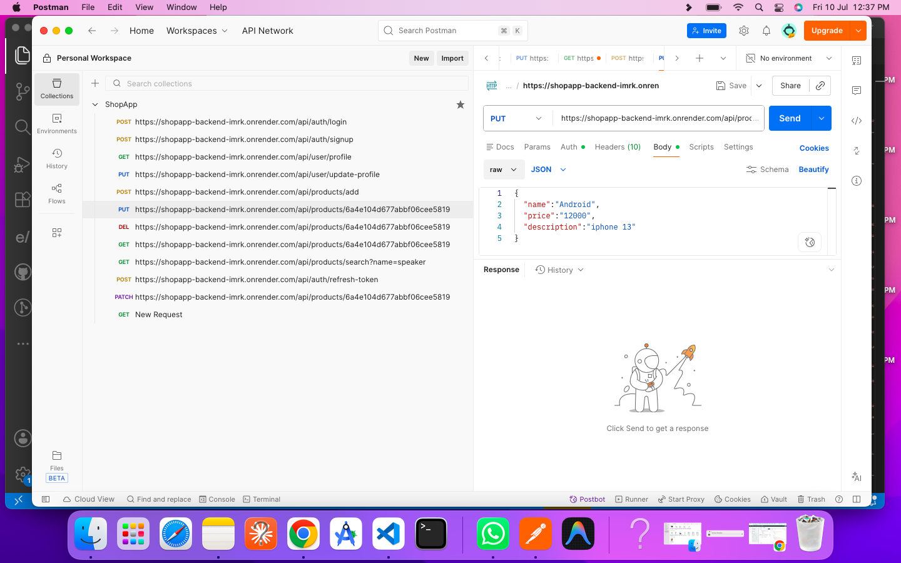
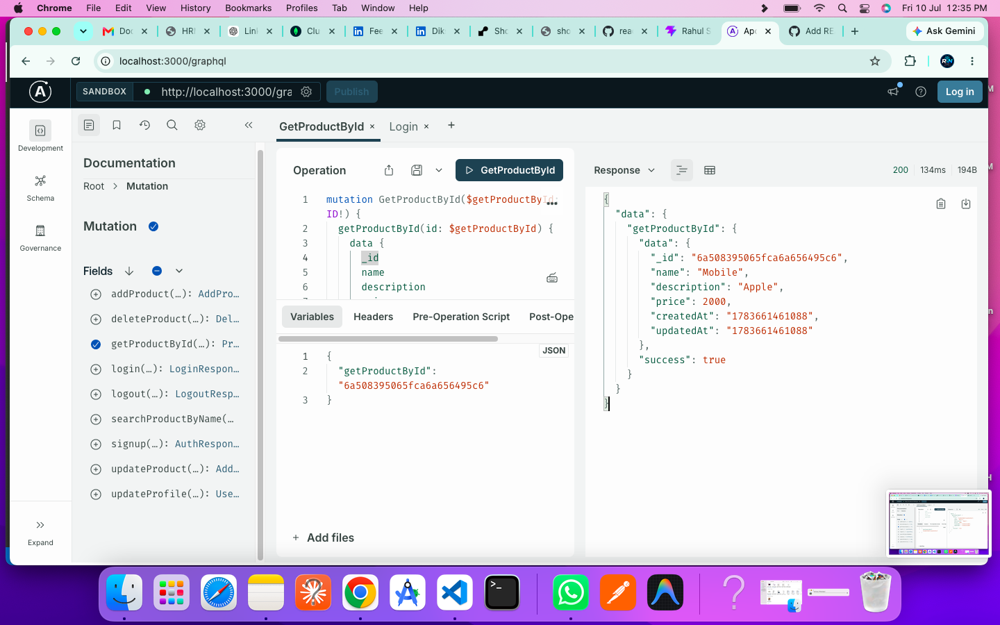

# 🛍️ ShopApp Backend API

A production-ready backend built with **Node.js**, **Express.js**, **MongoDB**, **REST API**, and **GraphQL (Apollo Server)**. This project demonstrates secure JWT authentication, Refresh Token authentication, User & Product Management, GraphQL integration, and a scalable service-layer architecture.

---

# 🚀 Live Demo

### REST API

https://shopapp-backend-imrk.onrender.com

### GraphQL Playground

https://shopapp-backend-imrk.onrender.com/graphql

---

# 🔗 GitHub Repository

https://github.com/reactxnative/ShopApp-Backend

---

# 📸 Project Screenshots

## GraphQL Playground



---

## User Authentication (Signup & Login)



---

## User Profile



---

## Product Management



---

# ✨ Features

- REST API
- GraphQL API (Apollo Server)
- JWT Authentication
- Refresh Token Authentication
- Secure Logout
- User Registration
- User Login
- User Profile
- Update Profile
- Product CRUD Operations
- Product Search
- MongoDB Atlas Integration
- Mongoose ODM
- Password Hashing using bcrypt
- Global Error Handling
- GraphQL Error Handling
- Service Layer Architecture
- Async Error Handling
- Environment Variables
- Production Ready

---

# 🛠 Tech Stack

### Backend

- Node.js
- Express.js
- MongoDB Atlas
- Mongoose

### Authentication

- JWT
- Refresh Tokens
- bcrypt

### GraphQL

- Apollo Server
- GraphQL

### Utilities

- dotenv
- express-async-handler

---

# 📂 Project Structure

```text
src
├── config
├── controllers
├── graphql
│   ├── resolvers
│   ├── schema
│   └── index.js
├── middleware
├── models
├── routes
├── services
├── utils
└── server.js
```

---

# 🌐 REST API Endpoints

## Authentication

| Method | Endpoint |
|---------|----------|
| POST | /api/auth/signup |
| POST | /api/auth/login |
| POST | /api/auth/refresh-token |
| POST | /api/auth/logout |

---

## User

| Method | Endpoint |
|---------|----------|
| GET | /api/user/profile |
| PUT | /api/user/update-profile |

---

## Product

| Method | Endpoint |
|---------|----------|
| POST | /api/products/add |
| GET | /api/products/:id |
| PUT | /api/products/:id |
| PATCH | /api/products/:id |
| DELETE | /api/products/:id |
| GET | /api/products/search?name=keyword |

---

# 🚀 GraphQL

### Endpoint

```
POST /graphql
```

### Authentication

#### Mutations

- signup
- login
- refreshToken
- logout

#### Queries

- getProfile
- getProduct
- searchProducts

#### Product Mutations

- addProduct
- updateProduct
- deleteProduct

---

# 🔐 Authentication

Protected APIs require a Bearer Token.

```http
Authorization: Bearer <access_token>
```

The same Authorization header is used for both REST APIs and GraphQL requests.

---

# ⚙️ Installation

Clone the repository

```bash
git clone https://github.com/reactxnative/ShopApp-Backend.git
```

Navigate into the project

```bash
cd ShopApp-Backend
```

Install dependencies

```bash
npm install
```

Create a `.env` file

```env
PORT=3000

MONGODB_URI=your_mongodb_connection_string

ACCESS_TOKEN_SECRET=your_access_secret

REFRESH_TOKEN_SECRET=your_refresh_secret
```

Start the development server

```bash
npm run dev
```

---

# 🧪 Testing

### REST APIs

- Postman

### GraphQL APIs

- Apollo Sandbox

---

# 📈 Highlights

- REST + GraphQL in a single backend
- Apollo Server Integration
- JWT Authentication
- Refresh Token Authentication
- MongoDB Atlas
- Mongoose ODM
- Global Error Handling
- GraphQL Error Handling
- Service Layer Architecture
- Scalable Folder Structure
- Clean Code Architecture
- Render Deployment

---

# 👨‍💻 About Me

**Rahul Singh**

Senior React Native | React | Node.js | GraphQL Developer

📧 Email  
reactxnative@gmail.com

💼 LinkedIn  
https://www.linkedin.com/in/rahul-singh-react-native/

🌐 Portfolio  
https://rahul-singh-profile.vercel.app/

📺 YouTube  
https://youtube.com/@ReactXNativeCode

⭐ If you found this project useful, don't forget to **Star** the repository.